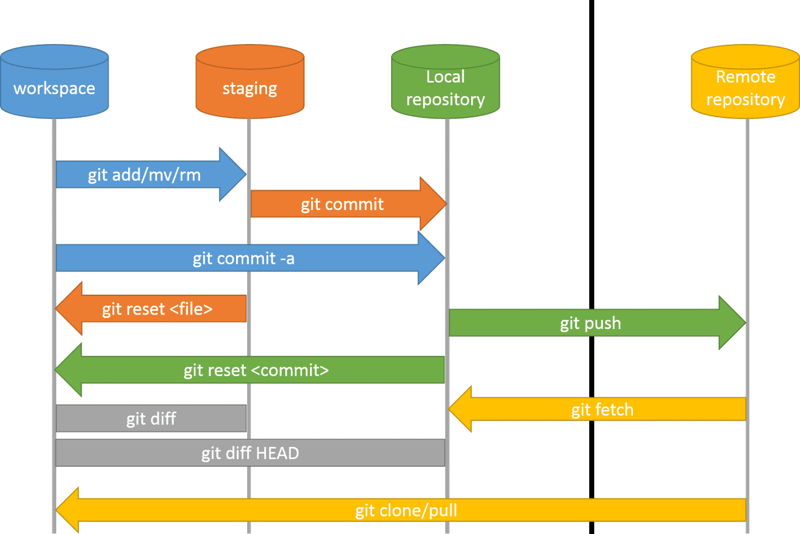

# 3. Trabajo en remoto

## Índice

[1. Comunicación con servidor](#1-comunicación-con-servidor)  
[2. Plataformas de desarrollo](#2-plataformas-de-desarrollo)  
[X. Resumen del flujo de trabajo](#x-resumen-del-flujo-de-trabajo)

## 1. Comunicación con servidor

Cuando se desea trabajar con un servidor remoto de Git, existen dos escenarios posibles:

- El proyecto ha sido inicializado localmente, tiene al menos un `commit` y no hay nada en el servidor.
- No hay nada localmente y el proyecto se encuentra en el servidor con al menos un `commit`.

Para el primer caso, se debe asociar el repositorio Git local a un servidor Git remoto mediante:

    git remote add origin urlRepositorio

Para el segundo caso, se debe clonar el repositorio remoto al entorno local:

    git clone urlRepositorio

fetch, push y pull

### Resumen del flujo de trabajo completo

### [Trazabilidad y auditoría]

.

## 2. Plataformas de desarrollo colaborativas

### BitBucket

.

### GitHub

.

### GitLab

.

## Referencias

[Tutorial completo](https://www.diegocmartin.com/tutorial-git/)  
[Sincronización](https://www.atlassian.com/es/git/tutorials/syncing)