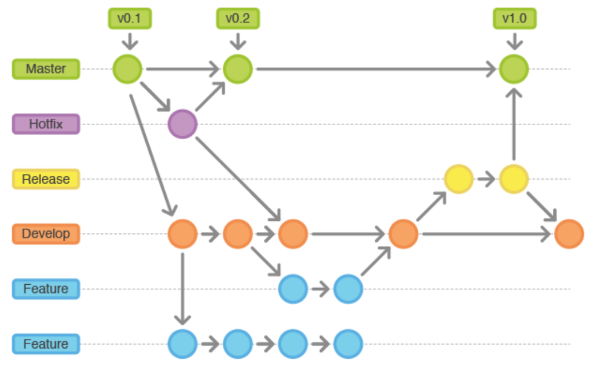
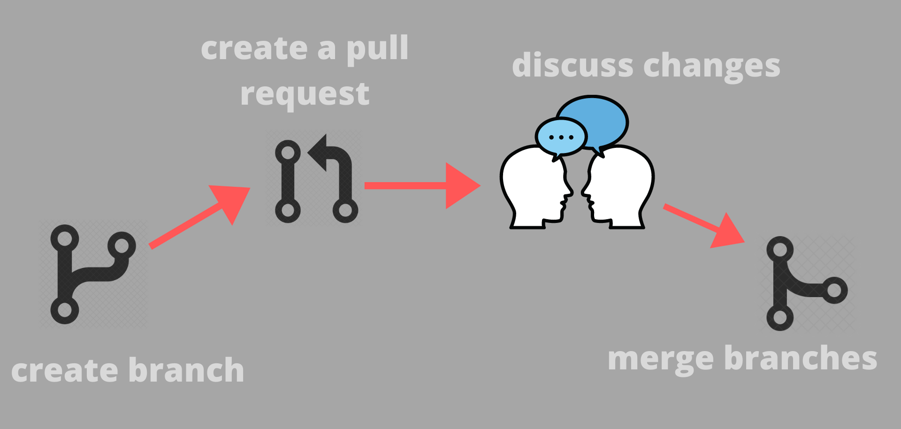

# 5. Flujo de trabajo en equipo

- [Estrategias de branching](#estrategias-de-branching)
- [Creación y gestión de Pull Requests](#creación-y-gestión-de-pull-requests)
- [Revisión de código y colaboración en equipo](#revisión-de-código-y-colaboración-en-equipo)
- [Uso de herramientas de integración continua](#uso-de-herramientas-de-integración-continua)
- [Ejercicios](#ejercicios)

## Estrategias de branching

## Creación y gestión de Pull Requests

## Revisión de código y colaboración en equipo

[...]

## Uso de herramientas de integración continua

[...]

## Ejercicios

Por parejas (o trío en caso de impares), cada uno deberá:

1. Crear un repositorio remoto vacío en GitHub llamado  `moby-git` y sincronizarlo con el repo local homónimo.
2. Añadir al otro compañero como colaborador del repositorio y a continuación pedirle que lo clone, modifique algún fichero en la rama principal y sincronice de nuevo.
3. Sincronizar en local los cambios efectuados por el otro compañero:
    - En caso de haber conflictos, arreglarlos.
    - En otro caso, simular un escenario en el que sí los haya, acordándolo con el compañero (e.g., modificando ambos la misma línea después de hacer `push` el creador del repo y `pull` el/los colaboradores).
4. Sincronizar con remoto la resolución de los conflictos y pedirle al compañero que sincronice de nuevo, modifique algún fichero en una rama nueva y sincronice de nuevo.
5. Sincronizar los cambios del compañero y hacer `merge` de su rama creada con la principal en local. Resolver conflictos si los hubiese.
6. Hacer un `fork` de un proyecto en GitHub de un compañero y *pushear* alguna modificación al repositorio *forkeado*.
7. Hacer un `pull request` a un proyecto en GitHub de un compañero y que este lo acepte o rechace.
8. Implementar una política de GitFlow en un repositorio propio en GitHub y hacer las operaciones necesarias para simular el ciclo completo de creación y despliegue de al menos una `feature` y un `hotfix`.

## Recursos

- [Skills Github](https://skills.github.com/)
- [Git History](https://githistory.xyz/)
